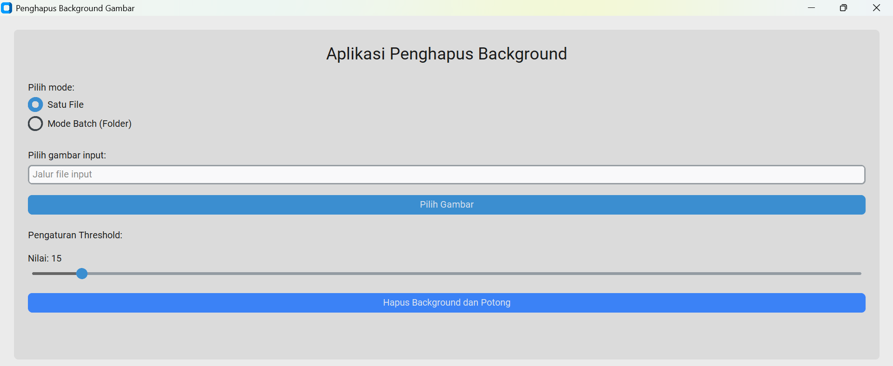

# Aplikasi Editor Gambar

Aplikasi desktop sederhana berbasis **Python** yang dikembangkan menggunakan **customtkinter** dan **Pillow**.  
Aplikasi ini memiliki dua fitur utama:

- **Penghapus Background**: Menghilangkan background dari gambar dan memotongnya secara otomatis.  
- **Pengubah Ukuran Gambar**: Mengubah ukuran gambar secara massal atau satu per satu.  

---

## Tampilan Aplikasi
Berikut adalah contoh antarmuka dari aplikasi ini.  


---

## Prasyarat
Sebelum menjalankan aplikasi, pastikan Anda telah menginstal **Python 3.x** di sistem operasi Windows Anda.

---

## Instalasi
Ikuti langkah-langkah berikut untuk menginstal dan menjalankan aplikasi:

### 1. Klon Repositori
Buka **Command Prompt** atau **PowerShell** dan klon repositori ini ke komputer Anda:

```bash
git clone https://github.com/alifmusthofa354/image-editor-python.git
```

### 2. Pindah ke Direktori Proyek
Masuk ke folder proyek yang baru saja Anda klon:

```bash
cd image-editor-python
```

### 3. Buat dan Aktifkan Lingkungan Virtual (Virtual Environment)
Untuk menjaga dependensi proyek tetap terisolasi, buat dan aktifkan lingkungan virtual:

```bash
python -m venv .venv
.venv\Scripts\activate
```

### 4. Instalasi Pustaka (Libraries) yang Dibutuhkan
Setelah lingkungan virtual aktif, instal semua pustaka yang dibutuhkan menggunakan **pip**:

```bash
pip install customtkinter Pillow rembg
```

### 5. Menjalankan Aplikasi
Setelah semua pustaka terinstal, Anda dapat menjalankan aplikasi dengan perintah berikut:

```bash
python main.py
```
Aplikasi akan terbuka dalam jendela baru, dan Anda siap menggunakannya.

### 6. Membuat File Executable (.exe)
Selain menjalankan aplikasi melalui skrip Python, Anda juga dapat membuat file executable (.exe) yang mandiri. File ini dapat dijalankan di komputer lain tanpa perlu menginstal Python atau pustaka lainnya.

Untuk membuat file `.exe`, jalankan skrip berikut:

```bash
python run_pyinstaller.py
```

Setelah proses selesai, Anda akan menemukan file executable di dalam folder `dist`.

---

## Fitur

### Hapus Background
Fitur ini memungkinkan Anda menghapus latar belakang dari gambar.

- Pilih mode **Satu File** atau **Mode Batch** untuk memproses gambar.
- Atur nilai **threshold** untuk mengontrol seberapa transparan piksel yang tersisa.
- Aplikasi akan menyimpan gambar tanpa background dalam format **PNG**.

### Ubah Ukuran Gambar
Fitur ini memungkinkan Anda mengubah dimensi gambar.

- Pilih mode **Satu File** atau **Mode Batch** untuk memproses gambar.
- Masukkan ukuran **lebar** dan **tinggi** yang Anda inginkan.
- Aplikasi akan mengubah ukuran gambar dan menyimpannya ke folder yang Anda tentukan.
